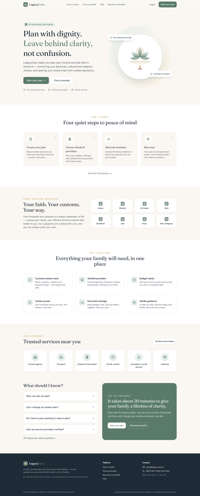
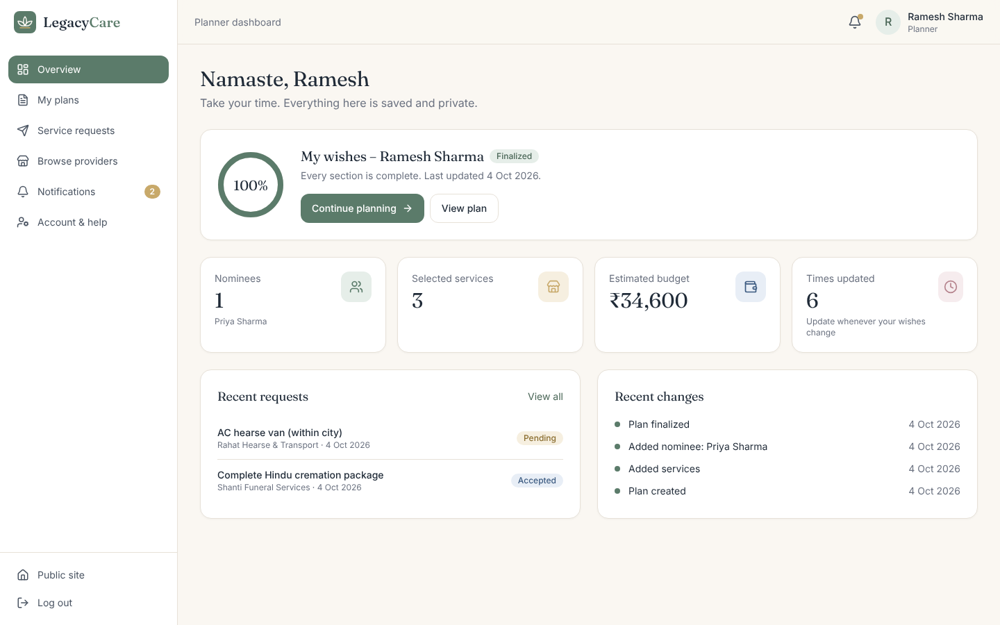
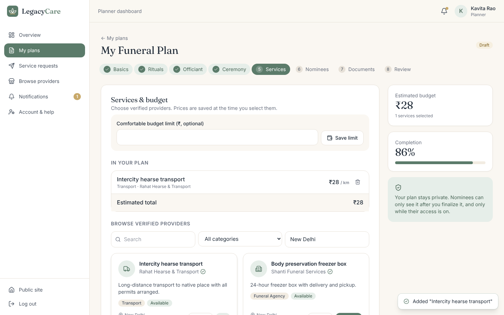
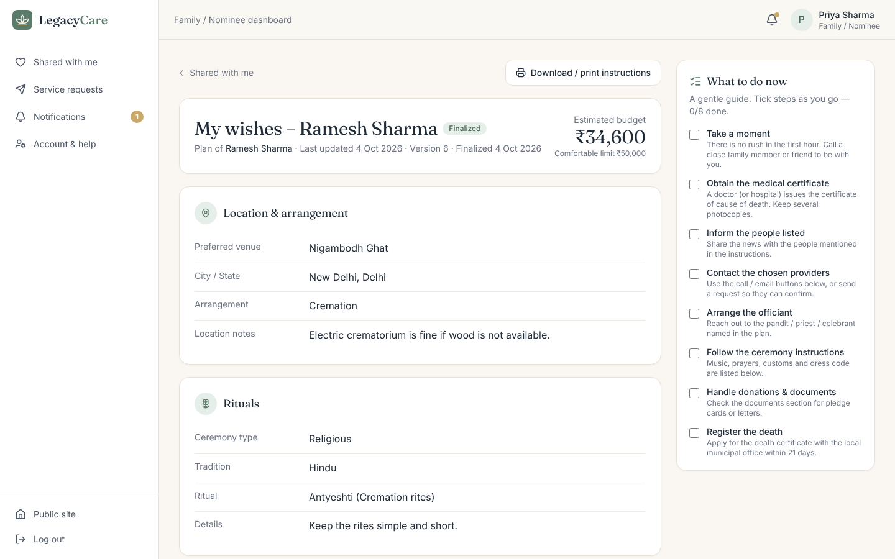
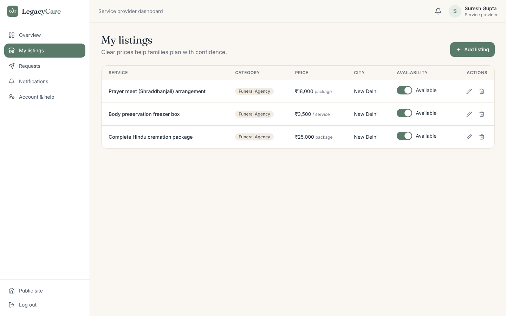
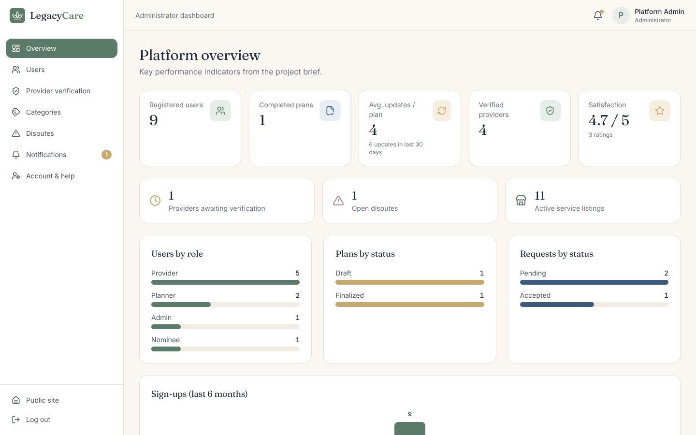

<div align="center">

# 🪷 LegacyCare
### Dignified End-of-Life & Funeral Planning Platform

**Unified Mentor Internship Project · MERN Stack**

[](__LIVE_URL__)
[](docs/LegacyCare_Project_Report.pdf)


</div>

---

## 📌 Project information

| | |
|---|---|
| **Project** | LegacyCare – Dignified End-of-Life & Funeral Planning Platform |
| **Program** | Unified Mentor – Web Development Internship |
| **Project ID** | 17815 |
| **Developer** | Lakshay Pandit |
| **Live demo** | __LIVE_URL__ |
| **Project report** | [docs/LegacyCare_Project_Report.pdf](docs/LegacyCare_Project_Report.pdf) |
| **Design reference** | [efuneral.com](https://www.efuneral.com/) |

## 📖 About

Elderly people, people living alone and people living far from family often worry about what will happen after they die. Without a plan, families are left making rushed, emotional decisions.

**LegacyCare** is a secure, calm web platform where a person can **pre-plan their funeral and last rites** according to their personal, cultural and religious wishes. They can choose **verified service providers** with clear prices, store important documents, and hand the plan to a **trusted nominee**, who sees it only when it is finalized and access is switched on.

## 🧪 Demo accounts

The live demo is pre-loaded with sample data. Use any account below. The login page also has one-click buttons that fill these in.

| Role | Email | Password |
|---|---|---|
| 👤 Planner | `ramesh@example.com` | `Planner@1234` |
| 👪 Nominee / Family | `priya@example.com` | `Nominee@1234` |
| 🏪 Service provider (verified) | `shanti@example.com` | `Provider@1234` |
| 🏪 Service provider (pending) | `peacehaven@example.com` | `Provider@1234` |
| 🛡️ Admin | `admin@legacycare.in` | `Admin@1234` |

## ✨ Features

### Planner
- Secure registration and login (bcrypt + JWT)
- **7-step plan wizard**: location & arrangement → rituals → officiant (pandit / priest / imam / granthi / celebrant) → ceremony instructions (🔒 encrypted) → services & budget → nominees → documents → review & finalize
- Pick funeral agency, transport, flower and pandit services from a verified directory, with a live budget estimate
- Upload documents (PDF/JPG/PNG/DOC, 5 MB) with labels
- Add nominees and switch their access on or off
- Edit any time, with version history; print or download the plan as PDF
- Send service requests to providers and track their status

### Nominee / family
- Sees **only finalized plans** shared with their email, and only while access is on
- Read-only plan view, document downloads, call/email providers, one-click service requests
- "What to do now" step-by-step guidance checklist, plus in-app notifications

### Service provider
- Registers with business and licence details; **hidden until verified by an admin**
- Create, edit and remove listings with pricing, city, traditions and availability
- Request inbox: accept, decline, mark completed, with a note to the family

### Admin
- KPI dashboard: registered users, completed plans, plan-update frequency, verified providers, satisfaction rating
- Verify or reject providers, verify or suspend users
- Manage ritual categories and service types
- Resolve disputes and escalations
- **Privacy by design**: admins see counts and statuses, never plan contents

## 🔐 Security
- AES-256-GCM field-level encryption for ceremony instructions, personal notes and nominee phone numbers
- Role-based access control on every API route, plus ownership checks
- Documents served only through an authenticated download endpoint
- Helmet, rate-limited auth, CORS allow-list, input validation and file-type limits

## 🏗️ Tech stack & architecture

```
React 19 + Vite + Tailwind CSS  ──►  Express REST API (Node.js)  ──►  MongoDB Atlas (Mongoose)
        (static, Vercel)               (Vercel serverless function)
```

| Layer | Technology |
|---|---|
| Frontend | React 19, Vite, Tailwind CSS v4, React Router, Axios, lucide-react |
| Backend | Node.js, Express, Mongoose, JWT, bcryptjs, Multer, Helmet |
| Database | MongoDB Atlas |
| Deployment | Vercel (frontend + API in one project) |

## 📁 Folder structure

```
legacycare/
├── api/index.js          # Vercel serverless entry (wraps the Express app)
├── client/               # React frontend
│   └── src/
│       ├── pages/        # public, planner, nominee, provider, admin, common
│       ├── components/   # UI kit, layouts, PlanSummary, ServiceCard, modals
│       ├── context/      # AuthContext
│       └── api/          # Axios client
├── server/               # Express backend
│   └── src/
│       ├── models/       # User, Plan, Service, ServiceRequest, Document, Category, Dispute, Notification, Feedback
│       ├── controllers/  # auth, plan, service, request, category, admin, misc
│       ├── routes/       # REST routes
│       ├── middleware/   # auth (RBAC), upload, error handling
│       └── utils/        # AES encryption, seed data, notifications
├── docs/                 # Project report, PRD, technical docs, UI prompt, screenshots
└── vercel.json
```

## 🚀 Run locally

**Requirements:** Node.js 18+ and a MongoDB connection string (free [MongoDB Atlas](https://www.mongodb.com/atlas) cluster or local MongoDB).

```bash
# 1. Clone
git clone https://github.com/lxkshxyy/LegacyCare-Unified-Mentor-Project.git
cd LegacyCare-Unified-Mentor-Project

# 2. Backend
cd server
npm install
cp .env.example .env        # Windows: copy .env.example .env
#   edit .env → set MONGO_URI, JWT_SECRET, ENCRYPTION_KEY (64 hex chars)
#   generate a key:  node -e "console.log(require('crypto').randomBytes(32).toString('hex'))"
npm run seed                # loads demo data
npm run dev                 # API on http://localhost:5000

# 3. Frontend (new terminal)
cd client
npm install
npm run dev                 # open http://localhost:5173
```

> **Windows tip:** if PowerShell blocks `npm`, type `cmd` first to switch to Command Prompt.
> **Atlas tip:** add `0.0.0.0/0` under Network Access, and make sure the cluster isn't paused.

## ☁️ Deployment (Vercel)

The repository deploys as **one Vercel project**: `client/dist` is served as static files, and every `/api/*` request goes to the Express app through `api/index.js`.

1. Import the repo in Vercel. The settings come from `vercel.json`.
2. Add environment variables: `MONGO_URI`, `JWT_SECRET`, `ENCRYPTION_KEY`, `NODE_ENV=production`.
3. Deploy. Run `npm run seed` locally against the same database to load demo data.

> On Vercel, uploaded documents are stored in temporary storage. Use S3 or Cloudinary for permanent file storage in production.

## 📸 Screenshots

| Home | Planner dashboard |
|---|---|
|  |  |
| **Plan wizard – services & budget** | **Nominee view with guidance** |
|  |  |
| **Provider listings** | **Admin KPI dashboard** |
|  |  |

## 📚 Documentation
- [Project Report (PDF)](docs/LegacyCare_Project_Report.pdf)
- [Project Analysis](docs/01_PROJECT_ANALYSIS.md)
- [Product Requirements Document](docs/02_PRD.md)
- [Technical Documentation & API reference](docs/03_TECHNICAL_DOCUMENTATION.md)
- [UI / Wireframe prompt](docs/04_UI_WIREFRAME_PROMPT.md)

## 🔮 Future enhancements
Mobile apps · email/SMS reminders · online payments · Hindi and regional languages · legal will integration · emergency notification workflow · cloud file storage

## 👤 Author
**Lakshay Pandit**: Web Developer · Unified Mentor Intern
GitHub: [@lxkshxyy](https://github.com/lxkshxyy)

---
<div align="center"><sub>Built with care as part of the Unified Mentor internship program.</sub></div>
